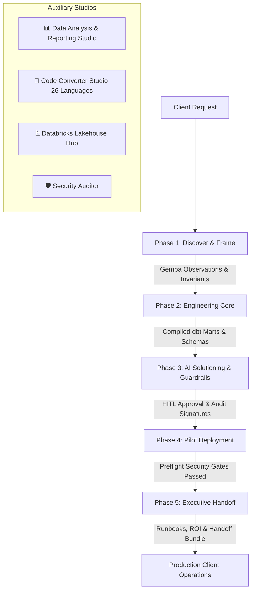
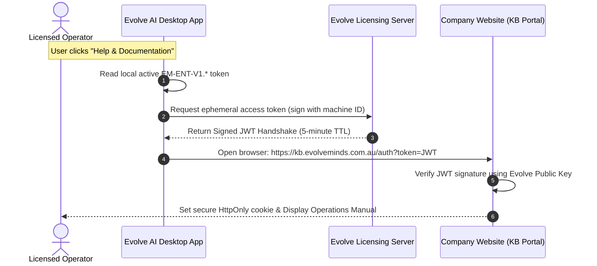

# 📘 Evolve AI Enterprise Studio — Comprehensive Operations Manual & Knowledge Base
> **Document Code:** `KB-DOC-OPS-2026`  
> **Classification:** Proprietary & Confidential — Authorized Enterprise Licensees Only  
> **Publisher:** Evolve Mind Solutions Pty Ltd (ABN 41 672 546 217) · Sydney, NSW, Australia  
> **Target Audience:** Forward-Deployed Engineers (FDE), Enterprise Architects, Data Engineers, and Lead Developers  

---

## 🔐 Document Access & Verification Policy
*This Knowledge Base document is maintained on the Evolve Mind Solutions Knowledge Portal (`https://kb.evolveminds.com.au`). Access is cryptographically gated and restricted exclusively to verified operators of Evolve AI Enterprise Studio holding an active `EM-ENT-V1.*` license token.*

---

## 📑 Table of Contents
1. [Platform Architecture & Executive Process Flow](#1-platform-architecture--executive-process-flow)
2. [End-to-End Document Flow & Artifact Topology](#2-end-to-end-document-flow--artifact-topology)
3. [Tab 1: Forward-Deployed Engineers (FDE) Delivery Studio (Phases 1–5)](#3-tab-1-forward-deployed-engineers-fde-delivery-studio)
   - [Phase 1: Discover & Frame (Observation-to-Spec)](#phase-1-discover--frame)
   - [Phase 2: Engineering Core & Data Introspection](#phase-2-engineering-core)
   - [Phase 3: AI Solutioning & Guardrails](#phase-3-ai-solutioning--guardrails)
   - [Phase 4: Pilot Deployment & Pre-Flight](#phase-4-pilot-deployment--pre-flight)
   - [Phase 5: Executive Handoff & Governance](#phase-5-executive-handoff--governance)
4. [Tab 2: Data Analysis & Reporting Studio](#4-tab-2-data-analysis--reporting-studio)
5. [Tab 3: Code Converter Studio (26 Multi-Target Languages)](#5-tab-3-code-converter-studio)
6. [Tab 4: Databricks Lakehouse & Unity Catalog Hub](#6-tab-4-databricks-lakehouse--unity-catalog-hub)
7. [Tab 5: Security Scanner & Pre-Flight Health Auditor](#7-tab-5-security-scanner--pre-flight-health-auditor)
8. [Tab 6: AI Copilot & Multi-Engine Chat](#8-tab-6-ai-copilot--multi-engine-chat)
9. [Tab 7: Local AI Hardware Auto-Detection & Sizer](#9-tab-7-local-ai-hardware-auto-detection--sizer)
10. [Tab 8: Git & Remote Repository Hub](#10-tab-8-git--remote-repository-hub)
11. [Tab 9: Multi-Cloud Connect Matrix](#11-tab-9-multi-cloud-connect-matrix)
12. [Tab 10: Settings, License Identity & EULA Viewer](#12-tab-10-settings-license-identity--eula-viewer)
13. [Website Knowledge Base Gating & Access Control Architecture](#13-website-knowledge-base-gating--access-control-architecture)

---

## 1. Platform Architecture & Executive Process Flow

Evolve AI Enterprise Studio operates on a **Deterministic-First, Air-Gapped Governance** paradigm. Probabilistic generative models are never given direct write access to operational stores. Instead, every client ask passes through an explicit 5-phase delivery pipeline:



---

## 2. End-to-End Document Flow & Artifact Topology

Every action in the Studio produces or consumes tangible, Git-trackable files in the client project workspace:

| Workspace Path | Producing Stage / Action | Consuming Component / Consumer | Purpose & Governance Role |
| :--- | :--- | :--- | :--- |
| **`.evolve/fde_state.json`** | Phase 1 autosave & `💾 Save Scope` | Desktop UI initialization & restore | Live serialized state of the current working draft. |
| **`.evolve/scope_versions.json`** | `📸 Snapshot Version` | Scope Version History Dropdown | Immutable historical log of all scope revisions with author & commit notes. |
| **`docs/discovery/SCOPE_v1.x.md`** | `📸 Snapshot Version` | Git review, PR audit, stakeholders | Versioned Markdown snapshot of Discovery Invariants & ROI. |
| **`docs/SCOPE_ALIGNMENT_MEMO.html`** | `📑 Export Client Memo` | Executive Steering Committee / CFO | Styled executive PDF/HTML brief defining out-of-scope rules and ROI. |
| **`docs/DATA_DICTIONARY.md`** | Phase 2 `Introspect Database` | Data Engineering & Analytics Teams | Full schema, types, nullable keys, and data lineage documentation. |
| **`models/staging/stg_core.sql`** | Phase 2 `Scaffold Staging Mart` | dbt runner, CI/CD pipelines | Compiled SQL transformation model enforcing data contract. |
| **`evals/hitl_audit_log.json`** | Phase 3 `LOG_HITL_ACTION` | Compliance Auditor, SOC 2 / ISO 27001 | Cryptographically verifiable log of all human approvals >$100. |
| **`docs/DEPLOYMENT_RUNBOOK.md`** | Phase 5 `Scaffold Runbook` | Operations & DevOps Teams | Step-by-step production failover, preflight checks, and rollback. |
| **`docs/CLIENT_HANDOFF_COMPLETE.md`** | Phase 5 `Generate Handoff Bundle`| Client Leadership & Procurement | Complete 14-day engagement delivery package and economic ROI report. |

---

## 3. Tab 1: Forward-Deployed Engineers Delivery Studio

The primary cockpit for leading a client engagement from Day 1 to Day 14.

### Phase 1 · Discover & Frame
*“Gemba Deconstruction · First-Principles Scoping · Observation-to-Spec (O2S)”*

#### Step 1: Discovery & O2S Spec
* **Action: Define Delivery Standard**: Choose between `Simple` (1-week POC), `Medium` (2-week standard engagement), or `Advanced` (enterprise multi-system migration).
* **Action: Capture Raw Customer Request**: Transcribe the exact client ask (e.g. *"Automate all refunds and support tickets with AI"*).
* **Action: Conduct Inquiry Probes**: Run targeted inquiry questions across Shadow IT, Failure Modes, Exception Icebergs, and Regulatory Gates.
* **Action: Record Gemba Floor Observations**: Document ground-truth realities observed when shadowing human operators (e.g., hidden spreadsheets, undocumented policy rules).
* **Action: Codify Invariants (Assumption vs. Invariant)**: Convert naive assumptions into hard physical invariants (e.g., *"Assumption: Model can issue refunds"* ➔ *"Invariant: Hard $100 ceiling; transactions >=$100 require supervisor signature"*).
* **Action: Set Operational Risk & Blast Radius**: Document the worst-case scenario and financial risk exposure.
* **Action: Frame Production Target (O2S)**: Formulate the real production system (e.g., *"Tier-1 Operations Co-Pilot with SQL lookup and Human-in-the-Loop gate"*).
* **Action: Enforce Out-of-Scope Boundaries**: Add explicit negative boundaries (e.g., `No direct DB write access`, `No automated refunds >$100`).

#### Step 2: The Controller's Three Numbers (ROI Calculator)
* **Inputs**:
  1. `Monthly Volume`: Number of times the manual process executes per month.
  2. `Handle Time (Mins)`: Average minutes spent per transaction by a human operator.
  3. `Hourly Wage ($/hr)`: Fully-loaded hourly rate of human operators.
* **Outputs**:
  * Monthly Financial Cost Saved ($ USD / month).
  * Annual Cost Savings (Expected Case).
  * Labor Hours Reclaimed per month.
  * FTE Capacity Unlocked.
  * Error Rate Drop Percentage.

#### Step 3: Workflow Topology (Mermaid Diagram)
* **Action**: Toggle between **As-Is Legacy Topology** (fragmented, manual spreadsheets) and **To-Be Automated Architecture** (deterministic staging core, LLM draft generator, human approval gate).
* **Action: Generate / Edit Diagram**: Edit Mermaid sequence diagrams with live syntax-checked canvas rendering.

#### Scope Versioning & Revision Management
* **Autosave**: Any text modification automatically triggers a 2.5-second debounce autosave into `.evolve/fde_state.json`.
* **Snapshotting (`📸 Snapshot Version`)**: Click to increment version (`v1.0` ➔ `v1.1` ➔ `v1.2`), enter an audit note, and generate `docs/discovery/SCOPE_v1.x.md`.
* **Time-Travel Rollback**: Select any prior version from the `Scope Version History` dropdown to immediately restore all fields and numbers from that point in time.
* **Exporting Client Alignment Memo (`📑 Export Client Memo`)**: Click to generate an executive-ready HTML/Markdown document (`docs/SCOPE_ALIGNMENT_MEMO.html`) citing the active version and standard.
* **Advancement (`🚀 Advance to Phase 2 ➔`)**: Validates that all invariants, risks, out-of-scope rules, and ROI numbers are complete before unlocking Phase 2.

---

### Phase 2 · Engineering Core & Data Introspection
*“Data Introspector · Schema Mapping · Compiled dbt Marts · Target Sync”*

* **Step 1: Live Database Introspection**:
  * Select database dialect: PostgreSQL, MySQL, Snowflake, Oracle, BigQuery, SQLite, or Databricks.
  * Connect via live credentials or local mock fixture to extract table definitions, primary keys, foreign keys, and nullability constraints.
* **Step 2: Schema Mapping & Data Dictionary Generation**:
  * Map legacy/source fields to target enterprise schema standards.
  * Click `Generate Data Dictionary` to emit `docs/DATA_DICTIONARY.md`.
* **Step 3: dbt Mart Scaffolding**:
  * Scaffold compiled SQL transformations in `models/staging/stg_core.sql` incorporating validation rules and audit columns (`_loaded_at`, `_source_hash`).
* **Step 4: Reverse ETL & Target Sync**:
  * Configure push synchronizations back to operational business systems (Salesforce, SAP, Snowflake, or Webhook).

---

### Phase 3 · AI Solutioning & Guardrails
*“Model Router · Anti-Hallucination · PII Masking · Human-in-the-Loop (HITL)”*

* **Step 1: Production Model Router**:
  * Select inference engine: Local Air-Gapped Ollama (`qwen2.5-coder`, `deepseek-r1`), Private Cloud (vLLM), or Frontier API (`claude-3-7-sonnet`, `gemini-2.5-pro`).
* **Step 2: Groundedness & Anti-Hallucination Gate**:
  * Ingest client SOP handbook chunks.
  * Compute groundedness score percentage; if groundedness <65% or claims are unverified, cryptographic signatures are withheld and output is flagged.
* **Step 3: PII & PHI Masking Engine**:
  * Automatically redact sensitive entities: Credit Card numbers, Social Security numbers / Tax File numbers, email addresses, phone numbers, and IP addresses before model ingestion.
* **Step 4: Human-in-the-Loop (HITL) Gate & Action Logger**:
  * Mandate human approval for any high-risk action (e.g. transactions >=$100).
  * Record supervisor approval in `evals/hitl_audit_log.json` with timestamp, transaction ID, supervisor ID, and cryptographic verification.

---

### Phase 4 · Pilot Deployment & Pre-Flight
*“Multi-Cloud Deployments · Pre-Flight Health Auditor · Ed25519 Signatures”*

* **Step 1: Multi-Cloud Infrastructure Scaffolder**:
  * Generate production deployment manifests for:
    * Google Cloud Run (`Dockerfile`, `cloudbuild.yaml`)
    * AWS App Runner (`apprunner.yaml`)
    * Azure Container Apps (`azure-deploy.json`)
    * Firebase Hosting & Cloud Functions (`firebase.json`)
    * Docker Standalone (`docker-compose.yml`)
* **Step 2: Pre-Flight Operational Health Auditor**:
  * Run automated security and environment checks:
    * Port availability and firewall binding
    * Environment variable and secret vault resolution
    * Air-gap outbound egress restrictions
    * License token validity and domain binding
* **Step 3: Cryptographic Deployment Lock**:
  * Generate SHA-256 integrity hash of all deployed code and sign with Ed25519 private key.

---

### Phase 5 · Executive Handoff & Governance
*“Production Runbook · Handoff Bundle · Economic ROI Realization”*

* **Step 1: Deployment Runbook Generation (`DEPLOYMENT_RUNBOOK.md`)**:
  * Synthesize operational procedures: service startup, health check endpoints, log streaming, secret rotation, disaster recovery, and incident escalation matrix.
* **Step 2: Client Engagement Handoff Bundle (`CLIENT_HANDOFF_COMPLETE.md`)**:
  * Consolidate the entire 14-day engagement into a definitive executive deliverable: executive summary, Phase 1 invariants, Phase 2 data lineage, Phase 3 HITL audit trail, and Phase 4 deployment status.
* **Step 3: Controller's ROI Realization Report**:
  * Compare baseline Phase 1 financial projections against actual measured pilot performance (hours reclaimed, error rate reduction, cost per transaction).

---

## 4. Tab 2: Data Analysis & Reporting Studio

Dedicated suite for rapid data intelligence, exploratory profiling, and deliverable synthesis without cloud data leakage.

### Process Flow
1. **Dataset Selection**:
   * Drag-and-drop or browse local dataset (`.csv`, `.tsv`, `.json`, `.parquet`).
   * Alternatively, select an active database table from Phase 2 Introspector.
2. **Deliverable Type Selection**:
   * **Executive HTML Report (`.html`)**: Rich, styled standalone dashboard with interactive charts, summary cards, and distribution tables.
   * **Python Analysis Script (`.py`)**: Production-ready script utilizing `pandas`, `pyspark`, or `sqlalchemy` for execution in Jupyter Notebooks or batch ETL.
   * **Schema & Column Profiling Matrix (`.txt`)**: Column cardinality, data types, null percentage, distinct values, and anomaly warnings.
   * **Executive Data Intelligence Insights (`.md`)**: High-level strategic findings and recommendations formatted in Markdown.
3. **Focus & Execution**:
   * Specify analysis focus (e.g. *"Identify customer churn drivers and revenue outliers"*).
   * Click `⚡ Run Data Analysis Deliverable`.
4. **Dual-View Review & Live Source Editor**:
   * **👁️ Visual Preview**: Sandboxed HTML iframe or formatted table view.
   * **📝 Code & Edit**: Direct source editor allowing in-place edits with live re-render.
5. **Actions**:
   * `📋 Copy Deliverable`: Copy code or formatted text to clipboard.
   * `🌐 Open in Browser`: Open executive HTML report in default browser or print to PDF.
   * `💾 Save Deliverable`: Save file directly to workspace root.

---

## 5. Tab 3: Code Converter Studio

Cross-stack polyglot code transformation supporting 26 enterprise languages with paradigm adaptation.

### Process Flow
1. **Input Code**:
   * Paste code directly or queue workspace files/folders.
   * Automatic source language detection from file extensions and syntax.
2. **Target Language Selection**:
   * Select from 26 languages: Python, TypeScript, JavaScript, Java, C#, Go, Rust, C++, C, Kotlin, Swift, Scala, Ruby, PHP, Dart, Elixir, R, SQL, Bash, PowerShell, Lua, Perl, VBA, COBOL, MATLAB, SAS.
3. **Fidelity & Dependency Policies**:
   * **Fidelity**: `Idiomatic` (target best practices), `Literal` (strict line-by-line), `Modernise` (upgrade to latest language version).
   * **Dependencies**: `Standard Library` (zero third-party imports), `Popular Ecosystem` (standard idioms like `pytest`, `pandas`, `tokio`), `Mirror Source`.
   * **Toggles**: Generate unit tests, carry comments across, emit dependency manifest.
4. **AI Inference & Fallback Synthesizer**:
   * Queries active local Ollama (`qwen2.5-coder:7b`, etc.) or cloud providers with 32k context and paradigm adaptation rules (e.g. translating loops into SAS `DATA` step observations).
   * If offline, engages deterministic multi-language synthesizer generating valid target syntax and safe comments.
5. **Side-by-Side Review & Fidelity Report**:
   * Inspect original vs target code side-by-side with line-matched scrolling.
   * Inspect Fidelity Report: AST mapped patterns, approximations, and human review notes.
   * Click `📋 Copy Output` or `💾 Save Converted File`.

---

## 6. Tab 4: Databricks Lakehouse & Unity Catalog Hub

Direct integration with Databricks SQL Warehouses and Unity Catalog.

* **Connection**: Enter Databricks Workspace URL, HTTP Path, and Personal Access Token (PAT) stored in encrypted local vault.
* **Catalog Explorer**: Browse Unity Catalogs, Schemas, Tables, and Views.
* **SQL Query Execution**: Run ad-hoc SQL queries against serverless or classic SQL warehouses.
* **Delta Lake Staging**: Push generated dbt models directly into Databricks Delta tables.

---

## 7. Tab 5: Security Scanner & Pre-Flight Health Auditor

Automated vulnerability scanner and static code analyzer.

* **Secret Detection**: Scans for hardcoded AWS keys, GCP service account JSONs, OpenAI/Anthropic API keys, private keys, and database passwords.
* **OWASP Top 10 & CWE Linters**: Scans SQL injection vectors, unvalidated inputs, insecure deserialization, and unquoted bash expansions.
* **Audit Report Generation**: Generates `docs/SECURITY_AUDIT.md` with severity levels (`CRITICAL`, `HIGH`, `MEDIUM`, `LOW`) and remediation instructions.

---

## 8. Tab 6: AI Copilot & Multi-Engine Chat

Interactive pair-programming and architectural reasoning assistant.

* **Model Selector**: Switch seamlessly between local Ollama models (air-gapped) and cloud frontier models (Claude 3.7 Sonnet, GPT-4o, Gemini 2.5 Pro).
* **Workspace Context Pinning**: Automatically embeds relevant files, schemas, and runbooks into context window.
* **Quick Action Prompts**: One-click shortcuts for Explain Code, Find Edge Cases, Write Unit Tests, and Optimize SQL.

---

## 9. Tab 7: Local AI Hardware Auto-Detection & Sizer

Real-time hardware inspection for air-gapped machine qualification.

* **Hardware Probing**: Detects physical CPU cores, total system RAM (GB), GPU model, and dedicated VRAM (GB).
* **Model Sizing Matrix**:
  * `< 8 GB RAM`: Quantized 3B models (`qwen2.5-coder:3b-q4_K_M`).
  * `16 GB RAM / 8 GB VRAM`: 7B models (`qwen2.5-coder:7b-instruct-q4_K_M`, `deepseek-r1:7b`).
  * `32 GB RAM / 16 GB VRAM`: 14B–16B models (`deepseek-coder-v2:16b`).
  * `64 GB+ RAM / 24 GB+ VRAM`: 32B+ models (`qwen2.5-coder:32b`).

---

## 10. Tab 8: Git & Remote Repository Hub

Native Git integration for branch isolation and delivery auditing.

* **Repository Inspection**: Inspect staged changes, untracked files, and active branch tracking.
* **Branch Switching**: Move between `main` (Enterprise), `community` (Marketplace), and engagement-specific feature branches.
* **Commit & Remote Push**: Stage, commit, and push changes over HTTPS or SSH to remote repositories.

---

## 11. Tab 9: Multi-Cloud Connect Matrix

Cloud connectivity testing and credential verification suite.

* **Providers Supported**: Amazon Web Services (AWS), Google Cloud Platform (GCP), Microsoft Azure, Firebase, and Databricks.
* **Test Connection**: Validates API authentication, bucket access, IAM permissions, and network latency without executing mutating commands.

---

## 12. Tab 10: Settings, License Identity & EULA Viewer

Enterprise identity, compliance, and legal safeguards.

* **License Gate & Status**: Displays active organization, plan tier (`Platinum`, `Enterprise Pilot`), expiration date, and seats.
* **Hardware Fingerprint**: Displays SHA-256 machine entropy hash used for node-locked installations.
* **In-App Legal Agreements**: Integrated viewer for End User License Agreement (EULA) and Master Terms & Conditions.
* **Display Scale & Zoom Controls**: Custom display scaling (80%–175%), text density modes (Compact, Balanced, Spacious), and high-DPI presets.

---

## 13. Website Knowledge Base Gating & Access Control Architecture

To ensure this Knowledge Base is hosted on the company website (`https://kb.evolveminds.com.au` or `https://www.evolveminds.com.au/kb/`) while remaining **exclusively accessible to verified users of the application**, the following three-tier gating architecture is recommended:



### Architectural Implementation Options

#### Option A: Ephemeral In-App Cryptographic Handshake (Recommended — Zero Password Friction)
1. **Desktop Action**:
   * Inside the Desktop App header or settings, add a button: `📖 Open Knowledge Base`.
   * When clicked, the desktop app generates an ephemeral, cryptographically signed token (HMAC-SHA256 or Ed25519) containing:
     ```json
     {
       "org": "Acme Financial Group",
       "email": "procurement@acme.com",
       "plan": "platinum",
       "exp": 1789287000
     }
     ```
   * The app opens the user's default browser to:
     `https://kb.evolveminds.com.au/auth?token=<SIGNED_TOKEN>`
2. **Web Portal Verification**:
   * The website backend verifies the signature against Evolve Mind Solutions' public key.
   * If valid, it establishes an `HttpOnly`, `SameSite=Lax` session cookie (`evolve_kb_session`) valid for 24 hours.
   * The user is automatically redirected to the Knowledge Base with zero login credentials required.

#### Option B: License Key Self-Service Gateway (`EM-ENT-V1.*`)
* For users accessing the website directly from a secondary device or mobile browser:
  * The Knowledge Base displays a simple authentication portal: *"Enter your Enterprise License Key to unlock documentation"*.
  * The user pastes their `EM-ENT-V1.*` key or uploads their `license.json`.
  * The web portal verifies the Ed25519 cryptographic signature client-side or via an edge worker, validating that the organization is licensed and unexpired.

#### Option C: Corporate Email Domain SSO (Google Workspace / Microsoft Entra)
* When enterprise licenses are issued to client domains (e.g. `@acme.com`), those domains are registered in the company website's Identity Provider (Auth0 / Supabase / Firebase Auth).
* Users log into the Knowledge Base using their corporate Google or Microsoft work accounts. Access is granted only if their email domain matches an active enterprise license.

---

*End of Operations Manual & Knowledge Base (`KB-DOC-OPS-2026`). Maintained by Evolve Mind Solutions Pty Ltd.*
