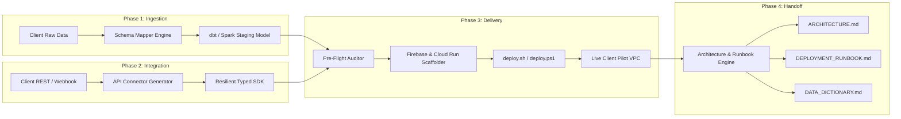
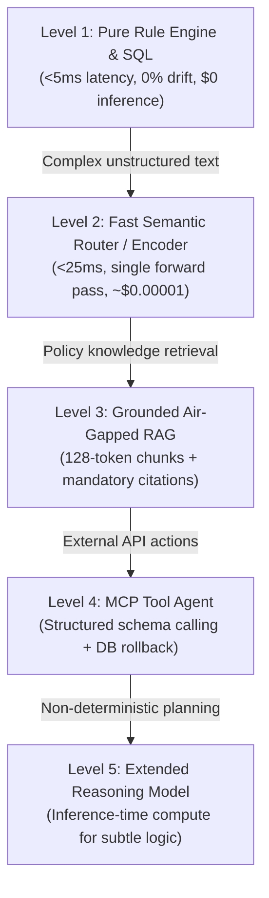

# Forward-Deployed Engineers (FDE) — Engagement Roadmap & Playbook

> **The Frontline Operating Guide for Client Pilots, Integrations & Production Deployments**
> *Published by [Evolve Mind Solutions Pty Ltd](https://www.evolveminds.com.au/)*

This guide provides a diagrammatic, step-by-step roadmap for Forward-Deployed Engineers (FDEs) using Evolve AI during client engagements.

---

## 1. The 14-Day Engagement Roadmap (Diagrammatic Overview)

```mermaid
journey
    title 14-Day Client Delivery Roadmap (FDE Playbook)
    section Phase 1: Data & Schema Ingest
      Inspect client raw tables/CSVs      : 5: FDE
      Semantic column mapping             : 5: FDE, Evolve AI
      Generate dbt/PySpark staging models : 5: Evolve AI
      Profile data quality anomalies      : 4: Evolve AI
    section Phase 2: Client API Integrations
      Ingest OpenAPI / cURL specs         : 4: FDE
      Generate resilient client SDK       : 5: Evolve AI
      Verify retry & backoff guardrails   : 5: FDE, Evolve AI
      Offline mock unit tests             : 4: FDE
    section Phase 3: Pilot Delivery & Pre-Flight
      Run deterministic Pre-Flight Audit  : 5: Evolve AI
      Clean dangling temporary files      : 5: Evolve AI
      Scaffold Firebase & Cloud Run       : 5: Evolve AI
      Deploy pilot (deploy.sh / deploy.ps1): 5: FDE
    section Phase 4: Client IT Handoff
      Render Mermaid architecture diagram : 5: Evolve AI
      Generate DEPLOYMENT_RUNBOOK.md      : 5: Evolve AI
      Compile DATA_DICTIONARY.md          : 5: Evolve AI
      Client signoff & operational handoff: 5: FDE, Client IT
```

---

## 2. End-to-End Delivery Architecture



---

## 3. Detailed Step-by-Step Playbook

### Phase 1: Data & Schema Ingest (Days 1–3)
1. **Drop Raw Data:** Place client sample CSV, JSON, or SQL DDL into your workspace.
2. **Open Schema Mapper:** Open `FDE (Beta)` in the chat sidebar Mode menu &rarr; click **1. Schema Mapper**.
3. **Review Mappings:** Evolve AI automatically maps foreign columns (e.g. `CUST_TXN_NBR` &rarr; `customer_id`, `TX_AMT` &rarr; `transaction_amount`).
4. **Emit Staging Model:** Click **Generate dbt Staging Model** to create `models/staging/stg_client_data.sql`.

---

### Phase 2: Client API Integrations (Days 4–7)
1. **Ingest Specs:** Paste the client's cURL request, Swagger JSON, or webhook payload into **2. Client API Studio**.
2. **Configure Auth:** Select auth scheme (OAuth2, Bearer Token, API Key).
3. **Generate SDK:** Click **Scaffold TypeScript SDK** or **Python SDK** to produce a typed connector with:
   - Exponential backoff with jitter.
   - `Retry-After` header parsing.
   - Rate-limiting guards to prevent tripping client firewalls.

---

### Phase 3: Validate & Pilot Delivery (Days 8–11)
1. **Run Pre-Flight Audit:** Click **Run Pre-Flight Audit** in **3. Pilot Deployment**.
   - Zero-AI local scan checks for `.bak`/`.tmp` files, secret leaks, `.env` parity, and Docker compliance.
   - Click **Clean Temporary Files** to eliminate dangling artifacts with 1 click.
2. **Scaffold Deployment:** Enter the client's GCP/Firebase Project ID & click **Scaffold Firebase & Cloud Run Config**.
   - Outputs `firebase.json` (SPA rewrites, immutable caching headers, security headers).
   - Outputs `./scripts/deploy.sh` and `./scripts/deploy.ps1`.
   - Outputs `.github/workflows/deploy.yml`.
3. **Execute Deployment:** Run `./scripts/deploy.sh pilot all` (or `.\scripts\deploy.ps1`).

---

### Phase 4: Client IT Handoff (Days 12–14)
1. **Generate Documentation:** Click **Generate All Client Handoff Docs** in **4. Runbook Factory**.
2. **Review Generated Artifacts in `docs/`**:
   - `docs/ARCHITECTURE.md`: Complete topology with interactive **Mermaid system diagrams**.
   - `docs/DEPLOYMENT_RUNBOOK.md`: Step-by-step maintenance, disaster recovery, and rollback procedures for client IT.
   - `docs/DATA_DICTIONARY.md`: Column-by-column transformation rules and confidence scores.

---

## 4. Pro-Tips for Forward Deployed Engineers

> [!TIP]
> **Strict Air-Gapped Mode:** When working on classified, banking, or defense client laptops, click the `$(shield) Air-Gapped` badge in the status bar. All schema mapping, pre-flight auditing, and deployment scaffolding run 100% locally with zero external network traffic.

> [!IMPORTANT]
> **Zero-Downtime Rollback:** If a client deployment fails, run `npx firebase-tools hosting:rollback` to instantly revert the frontend, and `gcloud run services update-traffic` to revert backend container traffic.

---

## 5. Model Selection & The Rule of Parsimony by Industry Vertical

During client discovery workshops, enterprise stakeholders often demand frontier 70B+ LLMs for every problem. As an FDE, your responsibility is to enforce the **Rule of Parsimony**: *always deliver at the lowest capability level that reliably solves the problem with zero unnecessary cost, latency, or drift.*

### 5.1 The 5 Capability Levels



### 5.2 Industry Vertical Playbook

Use the interactive **Model Advisor** (`aiForge.model.advisor`) in VS Code to demonstrate these decisions visually to client architects:

1. **Banking & Financial Services (`finance`)**
   - **Monetary Balances & Ledgers:** Deliver at **Level 1 (Pure Rule Engine & SQL)**. Zero probabilistic sampling. Deterministic boundary rules guarantee 0% hallucination and sub-5ms latency for audit compliance (SOX).
   - **Ingress Fraud Triage:** Deliver at **Level 2 (Fast Semantic Router / Encoder)**. Sub-25ms classification over event streams without paying for a full autoregressive generative decode loop.
   - **Compliance Manual Q&A:** Deliver at **Level 3 (Grounded Air-Gapped Policy RAG)**. Local vector embeddings (`nomic-embed-text`) with strict citation receipts.

2. **Healthcare & Life Sciences (`healthcare`)**
   - **HIPAA SOP & Clinical Protocols:** Deliver at **Level 3 (Grounded Air-Gapped Policy RAG)**. Disconnected local storage ensures PHI/PII never egresses client VPC.
   - **Patient Symptom Triage:** Deliver at **Level 2 with Mandatory Human-in-the-Loop (HITL)**. Below-threshold confidence routes immediately to physician review.
   - **Diagnostic & Lab OCR:** Deliver with **Document Layout OCR Models**. Retain tabular headers and numerical column alignments rather than standard text VLMs.

3. **Legal & Compliance (`legal`)**
   - **Multi-Clause Risk Auditing:** Deliver at **Level 5 (Extended Reasoning Model)**. Allocate inference-time compute to uncover subtle indemnification conflicts across schedules.
   - **Statutory Caps & Jurisdictional Ceilings:** Deliver at **Hybrid Level 1+3**. Hard rule checks gate semantic retrieval to prevent statutory violations.

4. **Defence & Air-Gapped Environments (`defence`)**
   - **Field Intel Search:** Deliver via **Air-Gapped Local SLM (7B–14B) + Local Vector Store**. Enforce zero telemetry and offline open weights (e.g. Qwen2.5 / Gemma2).
   - **Sensor Stream Telemetry:** Deliver at **Level 2 (Lightweight Edge Classifier)** for sub-15ms classification on tactical edge hardware.

5. **Retail & Supply Chain (`retail`)**
   - **ERP Inventory Rebalancing:** Deliver at **Level 4 (MCP Tool Agent)**. Connect to ERP databases via typed Model Context Protocol tools with mandatory transactional rollback.
   - **Demand Forecasting:** Deliver with **Deterministic Holt-Winters Forecaster (No LLM)**. Generative models hallucinate numbers; Holt-Winters provides true prediction intervals and changepoint detection.

6. **Software Engineering & DevOps (`software`)**
   - **Code Refactoring & Unit Tests:** Deliver via **Specialized Coder Models** (e.g. `qwen2.5-coder:7b`).
   - **As-You-Type Autocomplete:** Deliver via **FIM-Trained Models** (Fill-in-the-Middle, Ollama `insert` capability) for sub-50ms keystroke latency.

