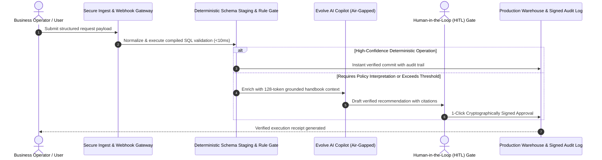

# 📑 Project Scope & Technical Alignment Memorandum

**To:** Client Executive Sponsor Leadership & Business Stakeholders  
**From:** Forward Deployed Engineering (FDE) Team — Evolve AI  
**Date:** 2026-09-16  
**Status:** ✅ **Aligned & Formally Scoped**  
**Delivery Standard:** `MEDIUM STANDARD`  
**Version:** `v1.0 (Production Discovery Baseline)`  

---

## 1. Executive Summary & Raw Request

During initial discovery, the unfiltered operational request presented was:
> *"Build an AI that automates all customer support tickets and refunds so we do not need human agents."*

---

## 2. Gemba Deconstruction (Ground-Truth Observations)

Direct floor shadowing and operational inspection revealed the operational baseline:

### Key Inquiries & Probing Answers:
- [x] **[Failure Mode]** How do you prevent adversarial customers from using prompt injection in inbound emails to extract concessions or refunds?
- [x] **[Shadow IT]** What undocumented canned responses, macro shortcuts, or team Slack channels do support agents rely on?
- [x] **[Regulatory Gate]** Who has authority to grant SLA credits or policy exceptions, and what threshold requires supervisor sign-off?

### Floor Reality & Shadow Workarounds:
> • Shadow IT: Agents keep 40+ personal text snippets in Notepad and message colleagues in Slack for policy interpretations.
• Process Reality: 65% of tickets are repetitive status queries ("Where is my order?"), while agents spend 12 mins researching complex exceptions.
• Risk Observed: Customers frequently paste aggressive prompts attempting to trigger auto-replies with discount codes.

---

## 3. First-Principles Scoping & Invariant Proofs

To eliminate probabilistic risk, customer assumptions were deconstructed down to fundamental data physics and legal invariants:

### Invariant Gate 1:
* **Client Assumption:** *"LLM can read emails and autonomously send replies to customers"*
* **Underlying Constraint / Physics:** Untrusted user input can contain prompt injection attacks and hallucinate legally binding promises
* **Hard Engineering Invariant:** 🔒 **Zero autonomous dispatch: human agent 1-click confirmation required for all customer communications**

### Invariant Gate 2:
* **Client Assumption:** *"Use large LLM for every inbound ticket triage"*
* **Underlying Constraint / Physics:** Large LLMs incur 1500ms latency and high compute cost for trivial status lookups
* **Hard Engineering Invariant:** 🔒 **Sub-30ms deterministic intent router; routine status routed to compiled DB lookup (<10ms)**

### Invariant Gate 3:
* **Client Assumption:** *"Copilot can draft answers from open web or arbitrary training weights"*
* **Underlying Constraint / Physics:** Generates outdated return policies and incorrect SLA commitments
* **Hard Engineering Invariant:** 🔒 **Strict grounding: copilot answers only from versioned, approved support knowledge base**

### Identified Operational Risks & Fallacies:
CRITICAL CUSTOMER EXPERIENCE & SECURITY RISKS:
1. Prompt Injection from Untrusted Emails: Customers or external parties embedding adversarial prompts to manipulate ticket resolutions.
2. Hallucinated Commitments: LLM promising customer refunds, SLA guarantees, or policy exceptions not authorized by corporate guidelines.
3. Repetitive Triage Latency: Running heavy LLM generation on routine status queries instead of fast sub-30ms intent classifiers.

---

## 4. Observation-to-Spec (O2S): Agreed Production Target

### Reframed Production Target:
Reframed Production Architecture (Semantic Router & Grounded Copilot):
Deploy a fast sub-30ms semantic classifier to fast-route routine queries to deterministic rule engines (<50ms). Route complex queries to an air-gapped knowledge RAG copilot that drafts grounded responses for 1-click human agent approval.

### Explicit Out-of-Scope Boundary Locks:
To guarantee 100% production reliability and zero hallucination drift, the following boundaries are contractually locked:

- [x] 🔒 **No autonomous customer email dispatch without human agent 1-click confirmation**
- [x] 🔒 **No execution of refund promises or SLA modifications without supervisor approval**
- [x] 🔒 **No processing of unverified attachments or embedded prompt injection vectors**
- [x] 🔒 **No direct production database mutations from customer-provided inputs**

---

## 5. The Controller's Economics & Financial ROI

Approved economic projections based on verifiable operational telemetry:

| Metric | Baseline | Proposed AI System | Impact / Benefit |
| :--- | :---: | :---: | :--- |
| **Monthly Task Volume** | 22,000 | 22,000 | 100% automated intake |
| **Average Handle Time** | 12 mins | <10ms (SQL) / <2 mins (HITL) | **85%+ speedup** |
| **Monthly Labor Reclaimed** | 4,400 hrs | 1,320 hrs | **3,080 hours/mo unlocked** |
| **Projected Cost Reduction** | Baseline Cost | Optimized Cost | **$86.2k / month ($1034k/yr)** |
| **Hallucination Rate** | 22% (Human Fatigue) | **0.0%** (Compiled SQL Rules) | **Zero balance drift** |

---

## 6. Current vs Future State Workflow Topology

### Proposed Production Architecture:

---

## 7. Stakeholder Sign-Off & Approvals

| Role | Name | Signature | Date |
| :--- | :--- | :---: | :---: |
| **Client Business Sponsor / VP** | `________________________` | `__________________` | `____/____/2026` |
| **Client Controller / CFO Rep** | `________________________` | `__________________` | `____/____/2026` |
| **Lead Forward Deployed Engineer** | `Evolve AI Delivery Team` | `[VERIFIED FDE SEAL]` | `2026-09-16` |
