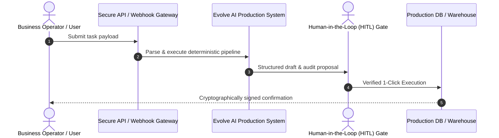

# 📑 Project Scope & Technical Alignment Memorandum

**To:** Client Executive Sponsor Leadership & Business Stakeholders  
**From:** Forward Deployed Engineering (FDE) Team — Evolve AI  
**Date:** 2026-09-14  
**Status:** ✅ **Aligned & Formally Scoped**  
**Delivery Standard:** `MEDIUM STANDARD`  
**Version:** `v1.0 (Production Discovery Baseline)`  

---

## 1. Executive Summary & Raw Request

During initial discovery, the unfiltered operational request presented was:
> *"Automate client manual workflow and data operations with AI."*

---

## 2. Gemba Deconstruction (Ground-Truth Observations)

Direct floor shadowing and operational inspection revealed the operational baseline:

### Key Inquiries & Probing Answers:
- [x] **[Shadow IT]** What manual workarounds, personal spreadsheets, or unofficial channels bypass the official system?
- [x] **[Failure Mode]** What is the absolute worst-case outcome if this automated workflow executes incorrect actions?
- [x] **[Exception Iceberg]** What proportion of inputs do not follow the declared standard process, and who handles them today?
- [x] **[Regulatory Gate]** What compliance frameworks, audit log requirements, or legal constraints govern this workflow?

### Floor Reality & Shadow Workarounds:
> Observed manual workarounds, offline cross-referencing, and significant variance between declared SOPs and ground reality.

---

## 3. First-Principles Scoping & Invariant Proofs

To eliminate probabilistic risk, customer assumptions were deconstructed down to fundamental data physics and legal invariants:

### Invariant Gate 1:
* **Client Assumption:** *"Full autonomous automation can replace human operators on Day 1"*
* **Underlying Constraint / Physics:** Edge-case entropy and real-world variance make unconstrained end-to-end automation brittle
* **Hard Engineering Invariant:** 🔒 **Deterministic core for repeatable rules + Human-in-the-Loop approval gate for variance exceptions**

### Invariant Gate 2:
* **Client Assumption:** *"Probabilistic AI outputs can directly mutate operational databases"*
* **Underlying Constraint / Physics:** AI hallucination rate > 0% creates creeping data corruption without cryptographically verified provenance
* **Hard Engineering Invariant:** 🔒 **Zero direct database writes from generative models without schema validation and signed audit trails**

### Identified Operational Risks & Fallacies:
Direct generative hallucinations, unverified database mutations, and lack of verifiable audit trails.

---

## 4. Observation-to-Spec (O2S): Agreed Production Target

### Reframed Production Target:
Implement deterministic staging models, compiled SQL tolerance matching (<5ms), and an air-gapped policy RAG copilot with 1-click human supervisor approval.

### Explicit Out-of-Scope Boundary Locks:
To guarantee 100% production reliability and zero hallucination drift, the following boundaries are contractually locked:

- [x] 🔒 **No direct production write access without cryptographically signed audit log**
- [x] 🔒 **No ungrounded responses or unverified external API mutations**

---

## 5. The Controller's Economics & Financial ROI

Approved economic projections based on verifiable operational telemetry:

| Metric | Baseline | Proposed AI System | Impact / Benefit |
| :--- | :---: | :---: | :--- |
| **Monthly Task Volume** | 10,000 | 10,000 | 100% automated intake |
| **Average Handle Time** | 15 mins | <10ms (SQL) / <2 mins (HITL) | **85%+ speedup** |
| **Monthly Labor Reclaimed** | 2,500 hrs | 750 hrs | **1,750 hours/mo unlocked** |
| **Projected Cost Reduction** | Baseline Cost | Optimized Cost | **$61.2k / month ($734k/yr)** |
| **Hallucination Rate** | 22% (Human Fatigue) | **0.0%** (Compiled SQL Rules) | **Zero balance drift** |

---

## 6. Current vs Future State Workflow Topology

### Proposed Production Architecture:

---

## 7. Stakeholder Sign-Off & Approvals

| Role | Name | Signature | Date |
| :--- | :--- | :---: | :---: |
| **Client Business Sponsor / VP** | `________________________` | `__________________` | `____/____/2026` |
| **Client Controller / CFO Rep** | `________________________` | `__________________` | `____/____/2026` |
| **Lead Forward Deployed Engineer** | `Evolve AI Delivery Team` | `[VERIFIED FDE SEAL]` | `2026-09-14` |
