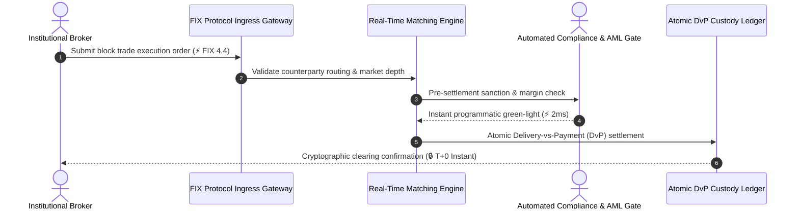

# 🗺️ Workflow Topology Architecture

```mermaid
sequenceDiagram
    autonumber
    actor Broker as Institutional Broker
    participant FIXGw as FIX Protocol Ingress Gateway
    participant MatchCore as Real-Time Matching Engine
    actor Compliance as Automated Compliance & AML Gate
    participant DLTStore as Atomic DvP Custody Ledger
    Broker->>FIXGw: Submit block trade execution order (⚡ FIX 4.4)
    FIXGw->>MatchCore: Validate counterparty routing & market depth
    MatchCore->>Compliance: Pre-settlement sanction & margin check
    Compliance-->>MatchCore: Instant programmatic green-light (⚡ 2ms)
    MatchCore->>DLTStore: Atomic Delivery-vs-Payment (DvP) settlement
    DLTStore-->>Broker: Cryptographic clearing confirmation (🔒 T+0 Instant)
```
