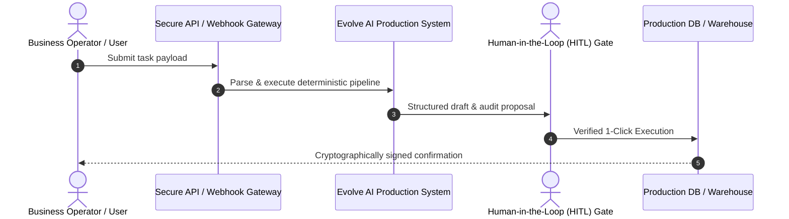

# 🗺️ Workflow Topology Architecture
> **Active Architecture Preset**: `custom`

```mermaid
sequenceDiagram
    autonumber
    actor Operator as Business Operator / User
    participant Ingest as Secure API / Webhook Gateway
    participant Agent as Evolve AI Production System
    actor Supervisor as Human-in-the-Loop (HITL) Gate
    participant Target as Production DB / Warehouse
    
    Operator->>Ingest: Submit task payload
    Ingest->>Agent: Parse & execute deterministic pipeline
    Agent->>Supervisor: Structured draft & audit proposal
    Supervisor->>Target: Verified 1-Click Execution
    Target-->>Operator: Cryptographically signed confirmation
```
