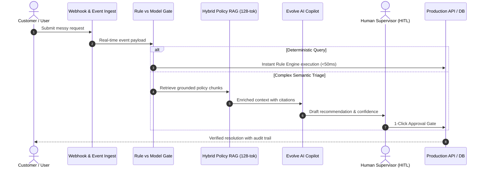

# 🗺️ Workflow Topology Architecture
> **Active Architecture Preset**: `support-copilot`

```mermaid
sequenceDiagram
    autonumber
    actor User as Customer / User
    participant Hook as Webhook & Event Ingest
    participant Router as Rule vs Model Gate
    participant RAG as Hybrid Policy RAG (128-tok)
    participant Copilot as Evolve AI Copilot
    actor Human as Human Supervisor (HITL)
    participant Core as Production API / DB
    
    User->>Hook: Submit messy request
    Hook->>Router: Real-time event payload
    alt Deterministic Query
        Router->>Core: Instant Rule Engine execution (<50ms)
    else Complex Semantic Triage
        Router->>RAG: Retrieve grounded policy chunks
        RAG->>Copilot: Enriched context with citations
        Copilot->>Human: Draft recommendation & confidence
        Human->>Core: 1-Click Approval Gate
    end
    Core-->>User: Verified resolution with audit trail
```
