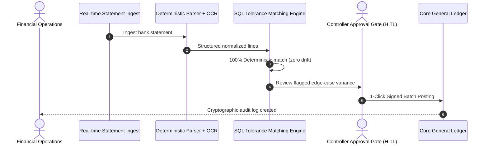

# 🗺️ Workflow Topology Architecture

```mermaid
sequenceDiagram
    autonumber
    actor FinOps as Financial Operations
    participant Hook as Real-time Statement Ingest
    participant Parser as Deterministic Parser + OCR
    participant Matcher as SQL Tolerance Matching Engine
    actor Human as Controller Approval Gate (HITL)
    participant ERP as Core General Ledger
    
    Hook->>Parser: Ingest bank statement
    Parser->>Matcher: Structured normalized lines
    Matcher->>Matcher: 100% Deterministic match (zero drift)
    Matcher->>Human: Review flagged edge-case variance
    Human->>ERP: 1-Click Signed Batch Posting
    ERP-->>FinOps: Cryptographic audit log created
```
