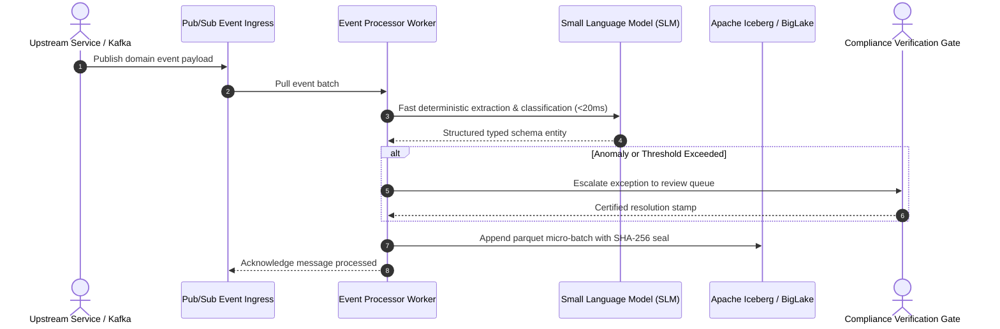

# 🗺️ Workflow Topology Architecture
> **Active Architecture Preset**: `greenfield-event`

```mermaid
sequenceDiagram
    autonumber
    actor Producer as Upstream Service / Kafka
    participant Queue as Pub/Sub Event Ingress
    participant Worker as Event Processor Worker
    participant Model as Small Language Model (SLM)
    participant Lake as Apache Iceberg / BigLake
    actor Audit as Compliance Verification Gate
    
    Producer->>Queue: Publish domain event payload
    Queue->>Worker: Pull event batch
    Worker->>Model: Fast deterministic extraction & classification (<20ms)
    Model-->>Worker: Structured typed schema entity
    alt Anomaly or Threshold Exceeded
        Worker->>Audit: Escalate exception to review queue
        Audit-->>Worker: Certified resolution stamp
    end
    Worker->>Lake: Append parquet micro-batch with SHA-256 seal
    Worker-->>Queue: Acknowledge message processed
```
