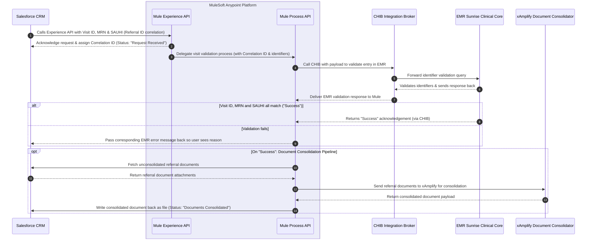

# 🗺️ Workflow Topology Architecture
> **Active Architecture Preset**: `mulesoft-api-led`

```mermaid
sequenceDiagram
    autonumber
    participant SF as Salesforce CRM
    box rgba(129, 140, 248, 0.1) MuleSoft Anypoint Platform
        participant MuleExp as Mule Experience API
        participant MuleProc as Mule Process API
    end
    participant CHIB as CHIB Integration Broker
    participant EMR as EMR Sunrise Clinical Core
    participant xAmplify as xAmplify Document Consolidator

    SF->>MuleExp: Calls Experience API with Visit ID, MRN & SAUHI (Referral ID correlation)
    MuleExp-->>SF: Acknowledge request & assign Correlation ID (Status: "Request Received")
    MuleExp->>MuleProc: Delegate visit validation process (with Correlation ID & identifiers)
    MuleProc->>CHIB: Call CHIB with payload to validate entry in EMR
    CHIB->>EMR: Forward identifier validation query
    EMR-->>CHIB: Validates identifiers & sends response back
    CHIB-->>MuleProc: Deliver EMR validation response to Mule

    alt Visit ID, MRN and SAUHI all match ("Success")
        EMR-->>MuleProc: Returns "Success" acknowledgement (via CHIB)
    else Validation fails
        MuleProc-->>SF: Pass corresponding EMR error message back so user sees reason
    end

    opt On "Success": Document Consolidation Pipeline
        MuleProc->>SF: Fetch unconsolidated referral documents
        SF-->>MuleProc: Return referral document attachments
        MuleProc->>xAmplify: Send referral documents to xAmplify for consolidation
        xAmplify-->>MuleProc: Return consolidated document payload
        MuleProc->>SF: Write consolidated document back as file (Status: "Documents Consolidated")
    end
```
